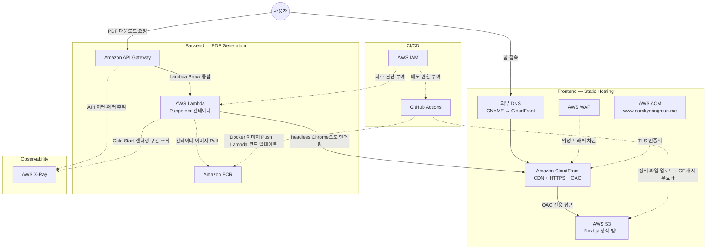

# 포트폴리오 AWS 서버리스 아키텍처

## 전체 트래픽 흐름

---

## 구성 요소 상세

### DNS / 도메인
| 항목 | 내용 |
|------|------|
| DNS 제공자 | 외부 (AWS Route53 미사용) |
| 연결 방식 | CNAME → CloudFront 배포 도메인 |
| 도메인 | `www.eomkyeongmun.me` |

### Frontend
| 서비스 | 역할 |
|--------|------|
| AWS S3 | Next.js `next export` 빌드 파일 저장. 퍼블릭 직접 접근 차단, OAC 경유만 허용 |
| Amazon CloudFront | 전 세계 CDN. OAC로 S3 접근, HTTPS 강제, WAF 연결 |
| AWS WAF | CloudFront 앞단 방화벽. 기본 관리형 규칙으로 악성 요청 차단 |
| AWS ACM | `www.eomkyeongmun.me` TLS 인증서 발급 (us-east-1 고정) |

### Backend
| 서비스 | 역할 |
|--------|------|
| Amazon API Gateway | REST API 엔드포인트. `/generate-pdf` 라우팅, Lambda Proxy 통합 |
| AWS Lambda | Puppeteer(헤드리스 Chrome) 컨테이너 실행. CloudFront `/portfolio/print` 페이지를 렌더링해 PDF 반환 |
| Amazon ECR | Lambda 컨테이너 이미지 저장소. 이미지 10개 보관 + untagged 7일 후 자동 삭제 |

### Observability
| 서비스 | 역할 |
|--------|------|
| AWS X-Ray | API Gateway → Lambda 전 구간 분산 추적. Cold Start·Puppeteer 렌더링 구간별 지연 시각화 |
| CloudWatch Logs | Lambda 실행 로그 수집. 14일 보관 |

### CI/CD & Security
| 서비스 | 역할 |
|--------|------|
| GitHub Actions | 프론트엔드: S3 업로드 + CloudFront 캐시 무효화. 백엔드: ECR 이미지 Push + Lambda 코드 업데이트 |
| AWS IAM | Lambda 실행 Role(CloudWatch·ECR·S3·X-Ray 권한), GitHub Actions 배포 User(S3·CloudFront·ECR·Lambda 권한) |
| Terraform | 전체 인프라 IaC 관리 (ACM은 us-east-1 provider 별도 지정) |

---

## 설계 핵심 원칙

1. **서버리스 최소 비용**: 정적 파일은 S3+CloudFront, PDF 생성처럼 요청이 드문 작업만 Lambda로 분리해 상시 서버 비용 없음
2. **S3 직접 접근 차단**: OAC(Origin Access Control)로 CloudFront를 통한 접근만 허용
3. **인프라 재현성**: Terraform으로 전체 리소스를 코드로 관리, 콘솔 수동 작업 없이 재현 가능
4. **최소 권한 원칙**: Lambda Role과 GitHub Actions User에 각각 필요한 권한만 부여
